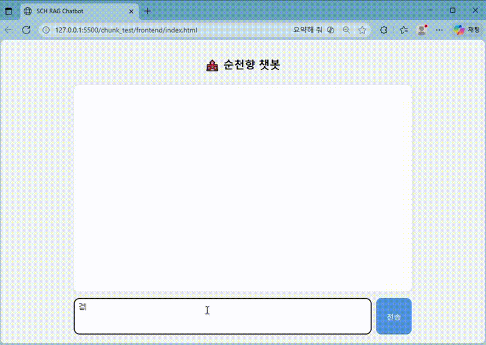
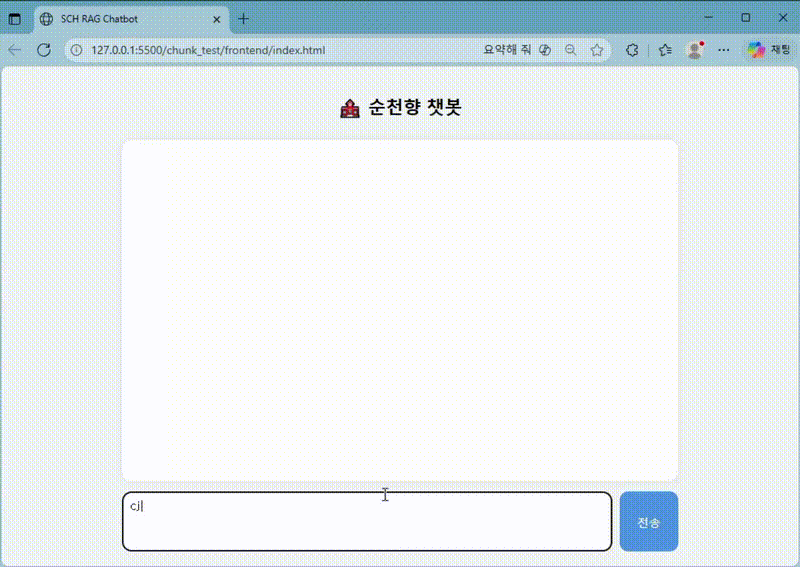

# 🎓Soonchunhyang University RAG Chatbot

> 순천향대학교 홈페이지 공지사항과 학사 정보를 자연어 질문으로 검색할 수 있는  
> Hybrid Retrieval 기반 RAG(Retrieval-Augmented Generation) 챗봇 시스템입니다.

     

---

## 1. Overview

본 프로젝트는 순천향대학교 홈페이지에 흩어져 있는 공지사항과 학사 정보를 사용자가 직접 찾아보지 않아도, 질문만으로 관련 정보를 검색하고 답변받을 수 있도록 설계한 학교 도메인 특화 RAG 챗봇입니다.

기존 방식에서는 사용자가 원하는 정보를 얻기 위해 학교 홈페이지의 여러 메뉴를 직접 이동하거나, 정확한 키워드를 입력해 검색해야 했습니다. 특히 장학금, 수강신청, 학사일정, 입찰공고처럼 공지 제목과 본문 표현이 다양한 정보는 단순 키워드 검색만으로 원하는 결과를 찾기 어렵습니다.

이 문제를 해결하기 위해 본 프로젝트에서는 다음 구조의 RAG 파이프라인을 구현했습니다.

```text
User Query
 → Query Rewrite (짧거나 모호한 질문에만 적용)
 → Follow-up 감지
    ├─ Follow-up: 이전 문서 재사용 → CrossEncoder Re-ranking
    └─ 신규 질문: Hybrid Search (FAISS GPU + BM25) → CrossEncoder Re-ranking
 → Neighbor Chunk Expansion
 → Context Assembly
 → LLM Answer Generation
 → Answer + Source URL
```

핵심 목표는 단순 챗봇 구현이 아니라, **학교 공지 데이터에 특화된 검색 품질 개선과 출처 기반 답변 생성**입니다.

---

## Demo



---

## Highlights

| Item              | Description                                        |
| ----------------- | -------------------------------------------------- |
| Task              | 순천향대학교 공지사항 기반 질의응답 챗봇                             |
| Data Source       | 순천향대학교 홈페이지 공지 데이터                                 |
| Data Size         | 2025년도 기준 약 2,228건                                 |
| Retrieval         | FAISS GPU Dense Search + BM25 Sparse Search        |
| Score Merge       | BM25 × 0.5 + Dense × 1.0 weighted combination     |
| Embedding Model   | multilingual-e5-large (CUDA)                       |
| Re-ranking        | BAAI/bge-reranker-base (CrossEncoder, CUDA)        |
| Follow-up Filter  | Semantic cosine similarity threshold (0.40)        |
| Context Expansion | Neighbor Chunk Expansion (±1 chunk)                |
| LLM               | Ollama 기반 Llama 3.1 8B (temperature=0.1, ctx=4096) |
| Backend           | Flask REST API                                     |
| Output            | 한국어 답변 + 근거 URL                                    |
| Evaluation        | Recall 0.850 / MRR 0.825                           |
| Response Speed    | 평균 2~3초                                            |

---

## 2. Motivation

학교 홈페이지에는 공지사항, 대학소개, 학사 정보 등 다양한 정보가 존재하지만, 사용자가 원하는 정보를 찾기 위해서는 직접 메뉴를 탐색하거나 검색어를 여러 번 바꿔가며 찾아야 합니다.

특히 다음과 같은 문제가 있었습니다.

* 공지사항이 여러 카테고리에 분산되어 있어 직접 탐색 시간이 길다.
* 사용자가 정확한 키워드를 모르면 관련 공지를 찾기 어렵다.
* 제목과 본문에 포함된 표현이 질문 표현과 다르면 검색 결과가 누락될 수 있다.
* 답변의 신뢰성을 위해 원문 URL 제공이 필요하다.

> 사용자가 "장학금 신청 기간 알려줘", "수강신청 관련 공지 있어?", "입찰공고 어디서 봐?"처럼 자연어로 질문하면, 관련 공지를 검색하고 출처와 함께 답변할 수 있을까?

이 질문을 해결하기 위해 RAG 기반 학교 챗봇을 설계했습니다.

---

## 3. Key Features

| Feature                 | Description                         |
| ----------------------- | ----------------------------------- |
| Domain-specific Chatbot | 순천향대학교 홈페이지 데이터에 특화된 질의응답           |
| Crawling Pipeline       | 학교 홈페이지 게시글 수집 및 메타데이터 구성           |
| Document Chunking       | 긴 공지사항을 문맥 단위로 분할하여 검색 품질 향상        |
| Dense Retrieval         | multilingual-e5-large + FAISS GPU 기반 의미 검색 |
| Sparse Retrieval        | BM25 + KoNLPy 형태소 기반 키워드 검색          |
| Hybrid Search           | Dense × 1.0 + BM25 × 0.5 가중 병합      |
| CrossEncoder Re-ranking | BAAI/bge-reranker-base 기반 후보 재정렬     |
| Query Rewrite           | 짧고 모호한 질문을 검색에 적합한 형태로 자동 보정        |
| Follow-up Handling      | Cosine similarity threshold 기반 이전 문서 재활용 |
| Neighbor Chunk Expansion | 검색된 chunk의 앞뒤 문맥 확장 (±1 chunk)      |
| Grounded Answer         | 검색된 context 기반으로만 답변 생성             |
| Source URL Citation     | 답변 근거가 되는 원문 URL 제공                 |
| Domain Guardrail        | 순천향대학교와 무관한 질문에 대한 응답 제한            |

---

## 4. System Pipeline

```text
[ DB 구성 파이프라인 ]

[1] Raw Web Documents
        ↓
[2] Crawling
        ↓
[3] Preprocessing
        - 불용어 및 불필요 텍스트 제거
        - 제목 / 본문 / 날짜 / URL 정리
        - 메타데이터 생성
        ↓
[4] Document Chunking
        - 문단 기반 분리 + 길이 조정 + overlap
        - chunk 단위 metadata 구성
        ↓
[5] Embedding
        - multilingual-e5-large (CUDA)
        - L2 정규화 적용 (cosine similarity 검색을 위한 전처리)
        ↓
[6] Index 구성
        - FAISS IndexFlatIP → GPU index
        - BM25Okapi (KoNLPy Okt 명사 토큰화)

━━━━━━━━━━━━━━━━━━━━━━━━━━━━━━━━━━━━━

[ 질의 처리 파이프라인 ]

[1] User Query (Raw)
        ↓
[2] Query Rewrite (짧거나 모호한 질문에만 적용)
        ↓
[3] Follow-up 감지
        ├─ Follow-up: 이전 문서 재사용
        │       → Cosine Similarity Filter (threshold=0.40)
        │       → CrossEncoder Re-ranking (top_k=5)
        └─ 신규 질문: Hybrid Retrieval
                - Dense Search (top_k=10) + BM25 Search (top_k=10)
                - 가중 score merge: BM25 × 0.5 + Dense × 1.0
                → CrossEncoder Re-ranking (BAAI/bge-reranker-base, CUDA, top_k=5)
        ↓
[4] Context Assembly
        - Neighbor Chunk Expansion (±1 chunk)
        - Context 최대 길이 2,000자 제한
        ↓
[5] RAG Answer Generation
        - CoT + Guardrail 프롬프트
        - Llama 3.1 8B (temperature=0.1, num_ctx=4096, num_predict=400)
        ↓
[6] Response
        - 한국어 답변 (3~5문장)
        - 근거 URL
        - 단일 턴 대화 메모리
```

---

## 5. Design Philosophy

이 프로젝트는 단순히 LLM에게 질문을 전달하는 챗봇이 아니라, **검색 품질과 답변 신뢰성**을 중심으로 설계했습니다.

### 1) Retrieval-first Design

LLM이 자체 지식으로 답변하지 않고, 먼저 학교 홈페이지 데이터에서 관련 문서를 검색한 뒤 검색된 context를 기반으로 답변하도록 구성했습니다. 이를 통해 hallucination을 줄이고, 학교 공지사항처럼 최신성과 출처가 중요한 정보에 대응할 수 있도록 했습니다.

### 2) Hybrid Retrieval

Dense retrieval은 의미적으로 유사한 문서를 찾는 데 강하지만, 특정 단어가 중요한 질문에서는 약할 수 있습니다. 예를 들어 "수강신청", "장학금", "입찰공고"처럼 정확한 키워드가 중요한 경우 BM25 검색이 더 유리할 수 있습니다.

반대로 BM25는 키워드가 정확히 일치하지 않으면 의미적으로 관련 있는 문서를 놓칠 수 있습니다. 따라서 FAISS 기반 dense search와 BM25 기반 sparse search를 결합하고, **Dense × 1.0 + BM25 × 0.5** 가중 병합으로 검색 안정성을 높였습니다.

### 3) Re-ranking for Precision

Hybrid retrieval로 넓게 후보 문서를 찾은 뒤(top_k=10), CrossEncoder를 사용해 질문과 문서의 관련도를 다시 계산해 top_k=5로 줄였습니다. 1차 검색은 recall을 높이는 역할, re-ranking은 최종 context의 precision을 높이는 역할을 담당합니다.

### 4) Neighbor Chunk Expansion

청크 단위로 검색하면 검색 정확도는 높아지지만, 답변 생성에 필요한 앞뒤 문맥이 잘릴 수 있습니다. 이 문제를 해결하기 위해 검색된 chunk의 앞뒤 1개 chunk를 함께 가져오는 **Neighbor Chunk Expansion(±1 chunk)** 을 적용했습니다. 검색 단위는 작게 유지하면서, 답변 생성에 필요한 문맥은 보존합니다.

### 5) Grounded Answer Generation

프롬프트 단계에서 검색된 context 기반 답변만 허용하도록 제한했습니다. 관련 정보가 검색되지 않은 경우에는 추측하지 않고 모른다고 응답하도록 설계했습니다. 또한 사용자가 답변의 근거를 확인할 수 있도록 원문 URL을 함께 제공합니다.

---

## 6. Design Decisions & Trade-offs

| Decision            | Alternatives                    | Selected                | Reason                                    |
| ------------------- | ------------------------------- | ----------------------- | ----------------------------------------- |
| Search Method       | Dense only / BM25 only / Hybrid | Hybrid Retrieval        | 의미 검색과 키워드 검색의 장점을 함께 활용                  |
| Score Merge         | Equal weight / Learned weight   | BM25×0.5 + Dense×1.0   | 학교 공지 특성상 의미 검색 비중을 높여 검색 품질 향상           |
| Vector DB           | Chroma / FAISS                  | FAISS (GPU)             | 로컬 GPU 환경에서 대규모 벡터 검색 속도 확보               |
| Sparse Retrieval    | 단순 키워드 매칭 / BM25                | BM25 + KoNLPy Okt       | 한국어 명사 기반 토큰화로 공지 키워드 검색 품질 확보            |
| Re-ranking Model    | Cross-encoder / Bi-encoder      | CrossEncoder (CUDA)     | 질문-문서 쌍을 직접 비교해 Bi-encoder 대비 정확도 우수      |
| Context Strategy    | Full document / Chunk only      | Neighbor Chunk Expansion | chunk 검색 정확도 + 앞뒤 문맥 보존의 균형               |
| Follow-up           | 항상 새 검색 / 이전 문서 재활용            | Semantic threshold 0.40 | 관련 후속 질문은 이전 문서를 재활용해 응답 일관성 유지           |
| Query Rewrite       | 항상 적용 / 조건부 적용                 | 짧거나 모호한 질문에만 적용         | 불필요한 rewrite로 인한 의미 왜곡 방지                 |
| LLM Serving         | API 기반 / 로컬 LLM                | Ollama (Llama 3.1 8B)   | 로컬 환경에서 재현 가능하고 비용 부담 없음                  |

---

## 7. Data

본 프로젝트는 순천향대학교 홈페이지 데이터를 기반으로 구축했습니다.

| Item              | Description                             |
| ----------------- | --------------------------------------- |
| Source            | 순천향대학교 홈페이지                             |
| Year              | 2025년도 데이터                              |
| Total Documents   | 약 2,228건                                |
| Main Fields       | id, category, title, content, date, url |
| Collection Method | Python 기반 crawling                      |
| Excluded Data     | 외부 사이트로 연결되는 데이터는 제외                    |

### Data Schema

| Field      | Description           |
| ---------- | --------------------- |
| `id`       | 고유 식별 번호              |
| `category` | 공지사항, 대학소개 등 게시글 카테고리 |
| `title`    | 게시글 제목                |
| `content`  | 게시글 본문                |
| `date`     | 게시글 등록일               |
| `url`      | 원문 주소                 |

### Included Data Files

| File               | Description                          |
| ------------------ | ------------------------------------ |
| `sch_metadata.pkl` | 원문 문서와 메타데이터                         |
| `chunk_df.pkl`     | chunk 단위 문서, embedding 정보, chunk_index |
| `chunk.index`      | FAISS vector index (L2 정규화, IP 기반)   |

### Intermediate Data Files (전처리 산출물)

| File           | Description                        |
| -------------- | ---------------------------------- |
| `df.pkl`       | 전처리 완료된 원문 데이터                     |
| `metadata.pkl` | chunk 단위 메타데이터 (FAISS 인덱스 빌더 산출물) |

> 전처리 및 데이터 생성 pipeline 전체 코드는 저장소에 포함되어 있지 않습니다.  
> 대신 실행 가능한 검색용 데이터와 인덱스 파일을 포함했습니다.

---

## 8. Document Chunking

긴 공지사항을 그대로 LLM context에 넣으면 context 길이 제한과 검색 정확도 문제가 발생할 수 있습니다. 따라서 게시글을 작은 단위로 분할하는 document chunking을 적용했습니다.

| Method                     | Description                | Pros            |
| -------------------------- | -------------------------- | --------------- |
| Fixed Window Chunking      | 일정 길이로 분리                  | 구현이 간단하고 빠름     |
| Semantic Chunking          | 의미 단위 기반 분리                | 문맥 유지에 유리       |
| Overlapping Sliding Window | chunk 간 일부 문장 겹침           | 문맥 단절 완화        |
| Hybrid Chunking            | 문단 기반 분리 + 길이 조정 + overlap | 검색 품질과 문맥 유지 균형 |

본 프로젝트에서는 긴 공지사항의 문맥 단절을 줄이기 위해 **문단 기반 분리 + 길이 조정 + overlap**을 적용했습니다.

```text
Raw Document
 → Paragraph Split
 → Length Control
 → Overlap
 → Chunk Metadata (chunk_index, original_id, title, url)
 → Embedding (multilingual-e5-large)
```

이 과정을 통해 검색 단위는 작게 유지하면서도, 답변 생성에 필요한 문맥은 보존하도록 했습니다.

---

## 9. Hybrid Retrieval

검색 단계에서는 Dense Search와 BM25 Search를 함께 사용했습니다.

### Dense Search: FAISS GPU + multilingual-e5-large

Dense retrieval은 문장의 의미적 유사도를 기반으로 관련 문서를 찾습니다. 사용자의 질문과 공지 본문이 정확히 같은 단어를 사용하지 않아도 의미적으로 가까운 문서를 찾을 수 있습니다. FAISS index를 GPU로 올려 검색 속도를 확보했습니다.

```text
Query
 → multilingual-e5-large Embedding (CUDA)
 → FAISS GPU IndexFlatIP Search
 → Top-k Dense Results
```

### Sparse Search: BM25 + KoNLPy

BM25는 키워드 기반 검색에 강합니다. 장학금, 수강신청, 학기, 방학, 입찰공고처럼 특정 단어가 중요한 학교 공지 검색에서 유용합니다. 한국어 특성을 고려해 KoNLPy Okt 형태소 분석기로 명사 중심 토큰화를 적용했습니다.

```text
Query
 → KoNLPy Okt Tokenization (명사 추출)
 → BM25Okapi Scoring
 → Top-k Sparse Results
```

### Score Merge

Dense Search와 BM25 Search 결과를 가중 병합해 최종 후보 문서를 구성했습니다. 의미 검색 비중을 높여 학교 공지의 다양한 표현에 대응할 수 있도록 설계했습니다.

```text
Dense Results (weight=1.0) + BM25 Results (weight=0.5)
 → Weighted Score Merge
 → Sorted Candidate Documents (top_k=10)
```

이 구조를 통해 의미 기반 검색과 키워드 기반 검색의 한계를 서로 보완했습니다.

---

## 10. Re-ranking Pipeline

1차 검색 결과는 recall을 확보하기 위해 넓게 가져옵니다(top_k=10). 이후 CrossEncoder를 사용해 질문과 후보 문서의 관련도를 다시 계산하고, 최종 context에 포함할 문서를 top_k=5로 선별합니다.

```text
Hybrid Search Candidates (top_k=10)
 → CrossEncoder Re-ranking (BAAI/bge-reranker-base, CUDA)
 → Final Context Documents (top_k=5)
```

### Follow-up Handling

이전 대화가 존재하는 경우, 이전 검색 결과 문서들을 재활용해 후속 질문에 응답합니다. 임베딩 캐시를 미리 구성해두고 cosine similarity가 0.40 이상인 문서만 필터링한 뒤 CrossEncoder로 재정렬합니다. 연속 질문에서도 검색 비용을 줄이고 응답 일관성을 유지할 수 있습니다.

```text
Previous Docs
 → Cosine Similarity Filter (threshold=0.40)
 → CrossEncoder Re-ranking
 → Final Context
```

### Why Re-ranking?

Dense와 BM25를 함께 사용하면 관련 후보를 넓게 찾을 수 있지만, 일부 문서는 실제 질문과의 관련도가 낮을 수 있습니다. Re-ranking은 최종 답변에 들어가는 context의 품질을 높이기 위한 단계입니다.

---

## 11. Neighbor Chunk Expansion

chunk 단위 검색은 정확도를 높이지만, 답변 생성에 필요한 앞뒤 문맥이 잘릴 수 있습니다. 이를 보완하기 위해 검색된 chunk의 동일 original_id 내에서 앞뒤 1개 chunk를 함께 포함하는 **Neighbor Chunk Expansion(±1 chunk)** 을 적용했습니다.

```text
Retrieved Chunk (chunk_index=N)
 → Same Document Neighbor Chunks (N-1, N, N+1)
 → Joined as Expanded Context
```

이 방식을 통해 검색 단위는 작게 유지하면서도, LLM이 답변을 생성하기에 충분한 문맥을 제공합니다.

---

## 12. Prompt Design & Guardrail

답변 생성 단계에서는 LLM이 검색 결과에 기반해 간결하고 신뢰성 있는 답변을 생성하도록 프롬프트를 설계했습니다.



### Key Rules

* 검색된 context 기반으로만 답변 (RAG Grounding)
* 순천향대학교와 관련 없는 질문은 제한 (Domain Guardrail)
* 관련 정보가 없으면 추측하지 않고 "I don't know" 반환
* 답변은 한국어로 3~5문장으로 간결하게 생성
* 후속 질문에서는 이전 답변을 반복하지 않고 추가 정보 제공
* 만료된 공지는 포함하지 않거나 만료 여부를 명시
* 답변 근거가 되는 URL 제공

### Domain Restriction

순천향대학교와 관련 없는 질문에 대해서는 다음과 같이 응답하도록 제한했습니다.

```text
저는 순천향대학교 챗봇입니다. 해당 질문에 대해서는 답변할 수 없습니다.
```

단, 학교 학생에게 유용할 수 있는 공모전, 해커톤, 장학금, 취업 기회, AI/빅데이터 행사 등은 context에 관련 정보가 있을 경우 제한 없이 답변하도록 설계했습니다.

---

## 13. API

### POST `/ask`

사용자의 질문을 입력받아 RAG 기반 답변을 반환합니다.

#### Request

```json
{
  "query": "장학금 관련 공지 알려줘"
}
```

#### Response

```json
{
  "answer": "장학금 관련 공지는 다음과 같습니다...",
  "url": "https://home.sch.ac.kr/...",
  "sources": [
    {
      "title": "장학금 신청 안내",
      "url": "https://home.sch.ac.kr/...",
      "category": "공지사항",
      "id": 1234
    }
  ]
}
```

### GET `/test`

서버 상태 확인용 헬스체크 엔드포인트입니다.

```json
{
  "status": "ok",
  "message": "server alive"
}
```

---

## 14. Evaluation

본 프로젝트는 검색 성능과 서비스 응답 속도를 중심으로 평가했습니다.

| Metric                | Value |
| --------------------- | ----- |
| Recall                | 0.850 |
| MRR                   | 0.825 |
| Average Response Time | 2~3초  |

### Evaluation Focus

* 사용자의 질문과 관련된 공지가 검색 결과에 포함되는가? (Recall)
* 가장 관련 있는 문서가 상위에 배치되는가? (MRR)
* 답변 생성 시 원문 context를 근거로 활용하는가?
* 실제 사용 가능한 응답 속도를 유지하는가?

Recall은 관련 문서를 검색 후보에 포함하는 능력을 확인하기 위한 지표이며, MRR은 정답에 가까운 문서가 얼마나 상위에 배치되는지 확인하기 위한 지표입니다.

---

## 15. Challenges & Solutions

| Challenge                           | Solution                                                         |
| ----------------------------------- | ---------------------------------------------------------------- |
| 학교 공지 표현이 다양하고 질문 표현과 다름           | Dense Search + BM25 Hybrid Retrieval로 의미와 키워드 동시 대응             |
| 한국어 키워드 검색 품질 저하                    | KoNLPy Okt 명사 중심 토큰화로 BM25 검색 품질 향상                            |
| Dense Search만으로는 특정 키워드 검색 약함       | BM25 결과를 weight 0.5로 병합해 키워드 검색 누락 완화                          |
| 검색 후보에 관련도 낮은 문서가 포함됨               | CrossEncoder (BAAI/bge-reranker-base) Re-ranking으로 precision 향상 |
| 긴 공지사항의 context 길이 초과 문제           | Document Chunking으로 게시글을 작은 단위로 분할                              |
| chunk 경계에서 문맥 단절로 LLM 답변 품질 저하      | 검색된 chunk 앞뒤 1개 chunk를 함께 포함하는 context expansion 설계           |
| 후속 질문에서 불필요한 재검색 및 응답 불일관성         | 이전 문서 재활용 + cosine threshold(0.40) 필터링으로 follow-up 처리          |
| 짧고 모호한 질문에서 검색 성능 저하               | Query Rewrite를 짧거나 모호한 질문에만 조건부 적용해 의미 왜곡 방지                   |
| LLM hallucination 및 도메인 외 답변 생성    | Context 기반 답변 제한 + Domain Guardrail 프롬프트 설계                    |
| 검색+임베딩+LLM 파이프라인의 응답 지연            | FAISS GPU 인덱스 + CrossEncoder CUDA + 임베딩 캐시로 응답 속도 2~3초 달성      |

---

## 16. Repository Structure

```text
hybrid-rag-chatbot/
│
├── RAG/
│   ├── backend/
│   │   ├── llm_server.py          # Flask 기반 RAG API 서버
│   │   ├── rag_chain.py           # 핵심 RAG 파이프라인 (검색, 리랭킹, 생성)
│   │   └── build_faiss_index.py   # FAISS 인덱스 빌더
│   │
│   ├── frontend/
│   │   ├── index.html             # 챗봇 UI
│   │   ├── app.js                 # API 요청 및 타이핑 애니메이션
│   │   └── style.css              # UI 스타일
│   │
│   └── data/
│       ├── sch_metadata.pkl       # 원문 문서 메타데이터
│       ├── chunk_df.pkl           # chunk 단위 문서 및 embedding 정보
│       ├── chunk.index            # FAISS vector index
│       ├── df.pkl                 # 전처리 완료된 원문 데이터 (전처리 산출물)
│       └── metadata.pkl           # chunk 단위 메타데이터 (인덱스 빌더 산출물)
│
├── video/
│   ├── demo.gif                   # 챗봇 데모
│   ├── CoT.gif                    # CoT 프롬프트 및 Guardrail 동작 예시
│   ├── figure1.mp4                # 발표용 자료
│   └── figure2.mp4                # 발표용 자료
│
├── requirements.txt
├── README.md
└── .gitignore
```

---

## 17. How to Run

### Requirements

* Python 3.10+
* CUDA 지원 GPU
* Ollama
* Llama 3.1 8B model
* FAISS index and preprocessed data files

### Installation

```bash
git clone https://github.com/csm3310/hybrid-rag-chatbot.git
cd hybrid-rag-chatbot

pip install -r requirements.txt
```

### Ollama Setup

```bash
ollama serve
ollama pull llama3.1:8b
```

### Backend Run

```bash
cd RAG/backend
python llm_server.py
```

서버 주소:

```text
http://localhost:5001
```

### Frontend Run

```bash
cd RAG/frontend
python -m http.server 5500
```

브라우저에서 접속:

```text
http://localhost:5500
```

---

## 18. Tech Stack

| Category               | Tools                                  |
| ---------------------- | -------------------------------------- |
| Language               | Python                                 |
| Backend                | Flask                                  |
| Frontend               | HTML, CSS, Vanilla JavaScript          |
| LLM                    | Ollama, Llama 3.1 8B                   |
| RAG Framework          | LangChain                              |
| Vector Search          | FAISS (GPU Accelerated)                |
| Sparse Search          | BM25 (rank-bm25)                       |
| Embedding              | multilingual-e5-large (CUDA)           |
| Re-ranking             | BAAI/bge-reranker-base (CrossEncoder)  |
| Korean Text Processing | KoNLPy (Okt)                           |
| Data Processing        | pandas, numpy, pickle                  |

---

## 19. Future Work

* 학교 홈페이지 데이터 자동 업데이트 기능 추가
* Query Intent Classification 기반 검색 전략 분기
* 공지사항 / 학사일정 / 장학금 / 입찰공고 등 도메인별 index 분리
* 멀티 턴 대화 메모리 확장
* 관리자용 데이터 업데이트 pipeline 구축
* 답변 품질 평가용 benchmark 질문셋 확장
* 의료용 도메인 챗봇으로 확장 가능성 검토

---

## Project Summary

본 프로젝트는 순천향대학교 홈페이지 공지사항을 대상으로 한 학교 도메인 특화 RAG 챗봇입니다.

단순 LLM 챗봇이 아니라, 크롤링한 학교 공지 데이터를 chunk 단위로 전처리하고, multilingual-e5-large 기반 FAISS GPU dense search와 KoNLPy 형태소 분석 기반 BM25 sparse search를 결합한 hybrid retrieval 구조를 적용했습니다. 이후 BAAI/bge-reranker-base CrossEncoder re-ranking, neighbor chunk expansion, cosine threshold 기반 follow-up handling, CoT + guardrail 프롬프트 설계를 통해 검색 정확도와 답변 신뢰성을 높였습니다.

특히 단순한 기술 조합이 아니라, 각 컴포넌트가 왜 필요한지를 고민하고, 가중치 설정(BM25×0.5 + Dense×1.0)부터 follow-up threshold(0.40), query rewrite 조건, context 길이 제한(2,000자)까지 실험을 통해 결정한 설계입니다.

---

## References

* Lewis et al., "Retrieval-Augmented Generation for Knowledge-Intensive NLP Tasks" (2020)
* Lost in the Middle: How Language Models Use Long Contexts
* Hybrid search using vectors and full text in Azure AI Search
